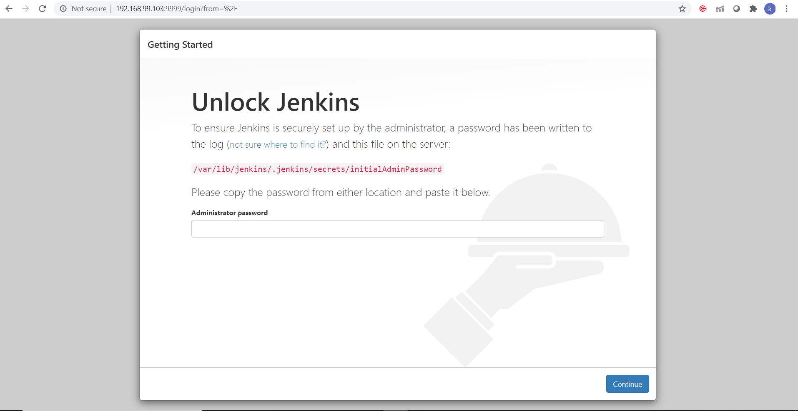

## Website Deployment Automation using jenkins

Tools Used:

Git and Github- for hosting our repository.

Jenkins- to automate various jobs.

Rhel8- as a base os for running services.

Docker- to Deploy webpages and jenkins.

Task Description:-

1. Create container image that’s has Jenkins installed using Dockerfile.

2. When we launch this image, it should automatically starts Jenkins service in the container.

3. Create a job chain of Job1, Job2, Job3 and Job4 using build pipeline plugin in Jenkins.

4. Job1 : Pull the Github repo automatically when developers push repository to Github.

5. Job2 : By looking at the code or program file, Jenkins should automatically start the respective language interpreter install image container to deploy code ( eg. If code is    of PHP, then Jenkins should start the container that has PHP already installed ).

6. Job3 : Test your app if it is working or not.

7. Job4 : if webpages areworking , then send confirmation email to developer.

8. Create One extra job Job5 for monitor : If container where app is running. fails due to any reason then this job should automatically start the container again.

1.To create customized image:

 To create a dockerfile I have created a new folder named mydocker.
 # mkdir mydocker/
 # cd /mydocker
 
 Then create a docker file in mydocker directory using
 
 #gedit Dockerfile
 
 write the following code:
 
 
 
 -> run command to create image
  docker build -t task2_mlops:v5 .  (here . represents the current directory)
    
    
   
    
   
    
  2.Now we have to run this image
  
  # docker run -it --privileged -p 9999:8080 -v /:/host task2_mlops:v5
  
  -  privileged is used to give container root capabilities of a host machine
  
  -  we have set the port 9999 of host machine to access the port 8080 of docker container on which the jenkins works.
  
  3.jenkins setup
  copy the password given after running the docker image.
    
  go to the browser
  
  then enter the url- Ip of host machine:9999

    
 
  4.Create your repository in github and add all the files there.
  
  5.Creating job1 in jenkins
  
   Job1 will pull the github repository automatically when the developer push any update.
 
.png)
.png)
   
  6.Creating Job2 in Jenkins-
  
   Job2 will look at the code or program file, and then automatically start the respective language interpreter install image container to deploy code i.e If code is of PHP, 
   
   then Jenkins should start the container that has PHP already installed and if the code is of HTML then jenkins should start container with httpd.
   
   I have used two images : httpd for html codes and vimal13/apache-webserver-php for php codes
   
   #docker pull httpd
      
   #docker pull vimal13/apache-webserver-php
      
   These images are downloaded on Base os
    
  
  
  Now create job 2 in jenkins :
  .png)
 
 .png)
   
  Here chroot is used to replicate the directory of docker container to our BaseOS.
    
  If everything is working fine You can check the Webpages
 
 .png)
    
 7. Creating job3 in jenkins
  Job3 will Test if our websites are working or not.
  
 .png)
 
 .png)
     
 8.Job4 will send the confirmation mail to the developer.
 .png)
     
 9. Creating job5 in jenkins
  This job will monitor If containers where websites are running. fails due to any reason then this job should automatically start that respective container again.
.png)
 
.png)
  
.png)
   
    
    
    
    
 
 
 
 
 
 
 
 
 
 
 
 
 
 
 
